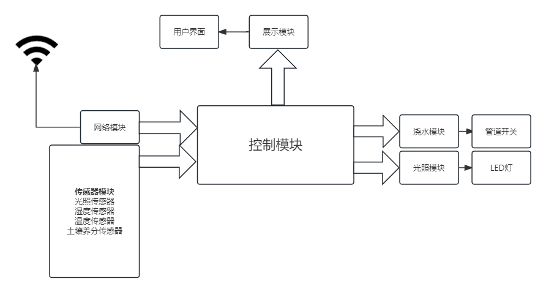
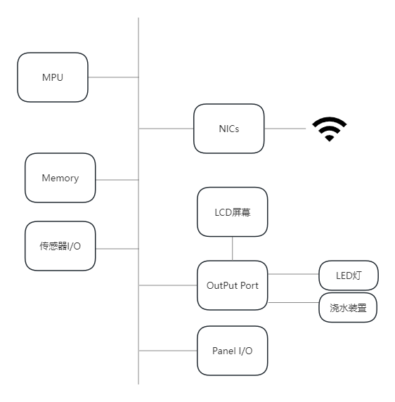
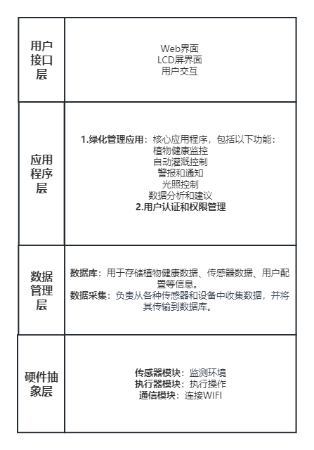

**1.嵌入式产品名字：**
智能绿化伴侣
**2.智能绿化伴侣功能：**
1. 环境监测：智能绿化伴侣装备了各种传感器，可以实时监测环境参数，包括温度、湿度、空气质量、土壤湿度和阳光强度。
2. 植物生长管理：该设备与一组可调控的喷灌系统和LED生长灯相结合，可以根据实时环境数据自动控制植物的灌溉和照明，以优化植物生长条件。
3. 自动化养护：智能绿化伴侣配备了机器学习算法，可以识别植物的种类并提供相应的生长建议。它还能够检测和应对植物健康问题，如虫害或疾病。
4. 远程监控与控制：用户可以随时随地通过手机应用远程监控和控制他们的植物，包括手动调整灌溉、照明和温度设置。

**3.智能绿化伴侣用途：**
1. 轻松种植：通过智能科技，让用户动动手指就能种植自己喜欢的绿植，用科技点缀美好生活。
2. 远程种植：用户可以在手机上远程浇水，即使出门在外也不用担心绿植缺水。
3. 自己种菜：可以通过该产品自己种植爱吃的蔬菜，可以有效减少农药和病虫的侵害。

**4.可行性分析：**
1. 传感器技术：
目前传感器能够准确地监测环境参数，如温度、湿度、土壤湿度、光照等，具备稳定性和精确性，可以提供提供可靠的数据。
2. 通信技术：
WIFI通信技术在大多数地区都普遍可用，可以通过它将设备与用户界面和云连接起来。这在小米智能家居中已经得到实现。
3. 用户界面和应用软件：
移动应用程序开发和云服务集成方面有许多开发工具和资源可用，开发用户友好的界面和应用软件是可行的。
4. 数据处理和分析： 
现代微控制器和嵌入式处理器提供足够的计算能力来处理传感器数据和执行数据分析。数据处理可行.
5. 植物养护：
目前植物生长、养护所需的养分、光照、水分等数据已经十分丰富，可以通过机器学习来分析出植物生长所需的最佳环境。

**5.智能绿化伴侣系统总体体系结构：**

**6.智能绿化伴侣硬件体系结构：**

**7.智能绿化伴侣软件体系结构：**

