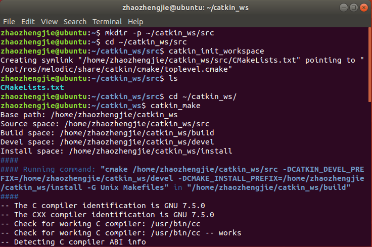
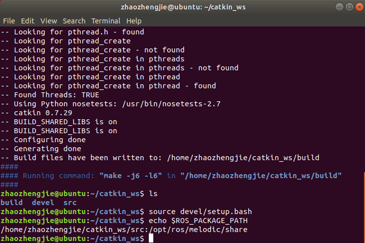
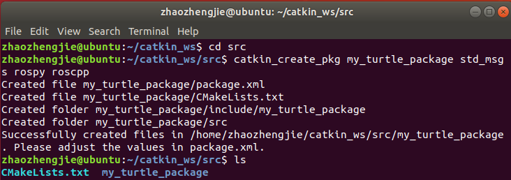
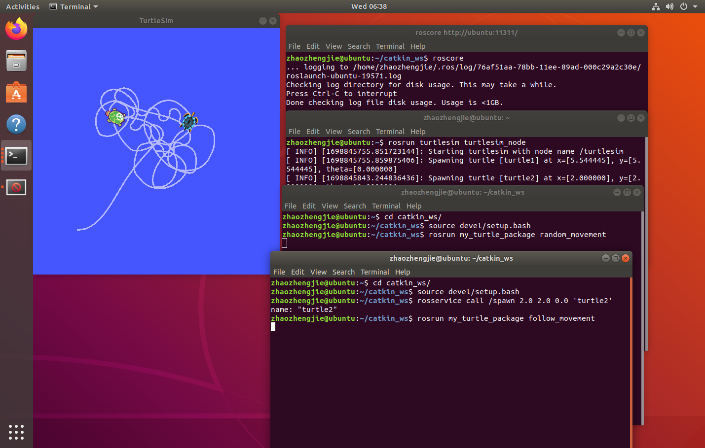

# ROS实验报告
211250109 赵政杰
# 实验内容
选择实现**内容C**：
- 实现两个小乌龟，其一随机运动，另一只跟随此小乌龟的运动方式。
# 实验步骤
1. ROS工作空间建立

2. 编写程序

实现两个程序`random_movement.cpp`和`follow_movement.cpp`
    - `random_movement.cpp`负责实现乌龟turtle1的随机移动
    - `follow_movement.cpp`负责实现乌龟turtle2的跟随移动
3. 运行
