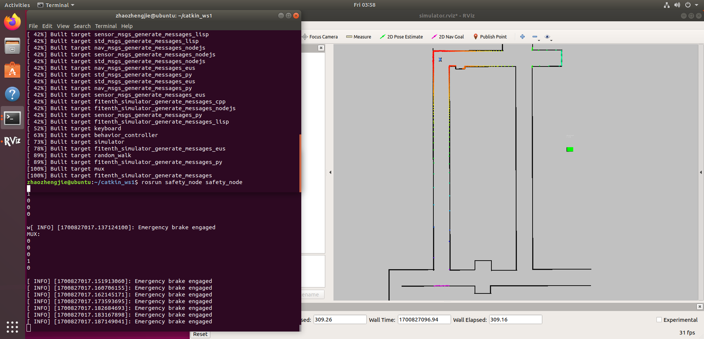

# AEB实验
211250109 赵政杰
## 1.使用的TTC模型
使用如下公式以计算TTC：
$$
TTC = \frac{r}{[-r']_+}
$$
其中
- $r$是两个物体之间的距离
- $r'$是这个距离的时间导数，即为小车速度在该方向上的分量
- 运算符$[]_+$定义为：$[]_+:=max(x, 0)$
  
代码实现如下：
```cpp
if(scan_msg->ranges[i] >= scan_msg->range_min && scan_msg->ranges[i] <= scan_msg->range_max) {
    // 获得障碍物的距离和方向
    obstacle_distance = scan_msg->ranges[i];
    obstacle_angle = scan_msg->angle_min + i * scan_msg->angle_increment;
    // 计算速度分量
    relative_speed = speed * std::cos(obstacle_angle);
}
// 若该方向上的速度矢量为正，计算TTC
if(relative_speed  > 0.0) {
    ttc = obstacle_distance / relative_speed;
}
```
## 2.亮点/重点
实验重点：
1. 首先是TTC模型的选取与实现，要对速度进行相应的分解
2. 确定TTC的阈值，及时发布刹车信息

实验亮点：
1. 如果计算得到的某方向的速度分量是负值，说明小车正在远离该障碍物，不用计算TTC，加快处理速度
## 3.实验及结果
1. 在上次实验的项目中建立一个新的节点文件夹
```sh
cd ~/catkin_ws1/src
catkin_create_pkg safety_node std_msgs sensor_msgs ackermann_msgs rospy roscpp
```
2. 编写相应的cpp文件并更改CMakeLists
3. 运行程序
```sh
# 终端1
cd ~/catkin_ws1
source devel/setup.bash
roslaunch f1tenth_simulator simulator.launch
# 终端2
cd ~/catkin_ws1
catkin_make
source devel/setup.bash
rosrun safety_node safety_node
```
4. 运行截图

5. 具体过程请参见视频