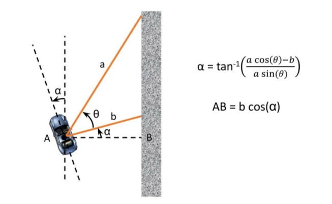
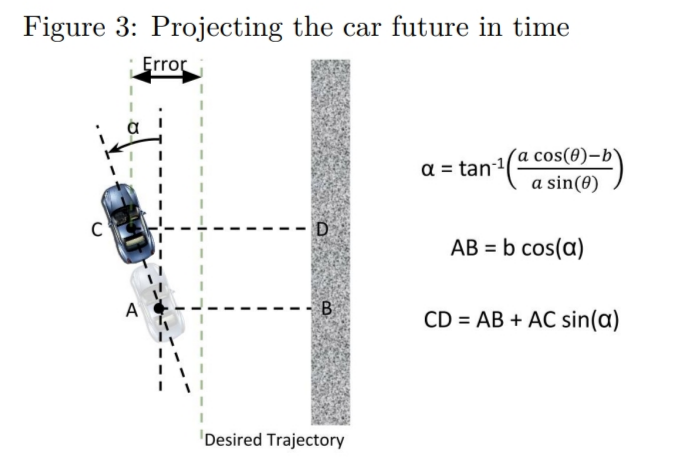
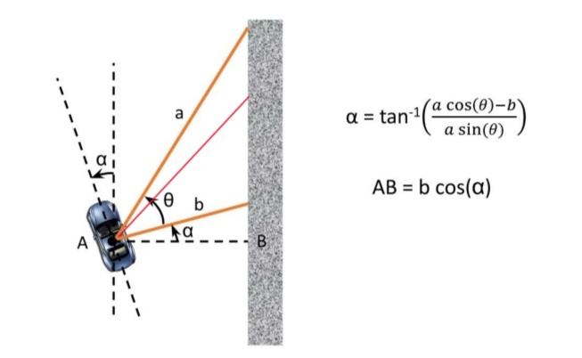
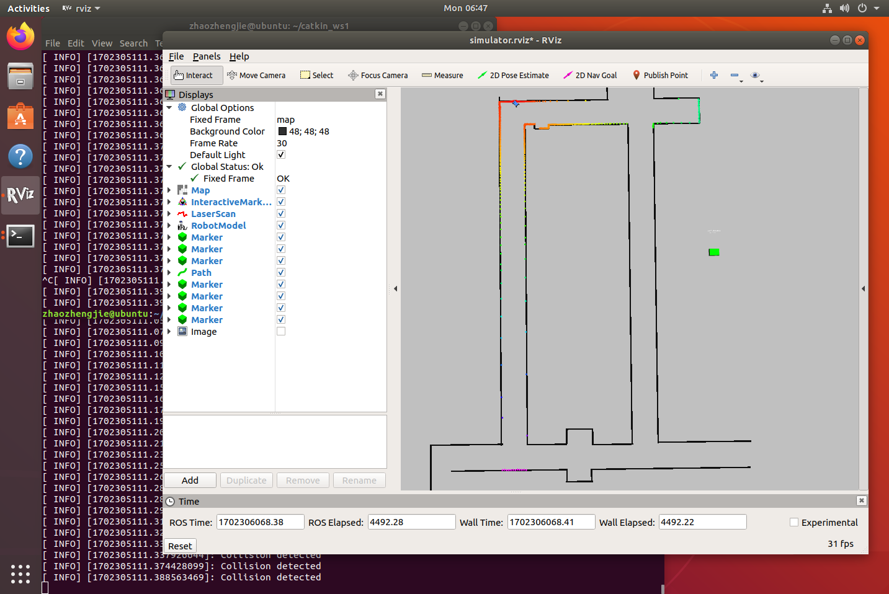
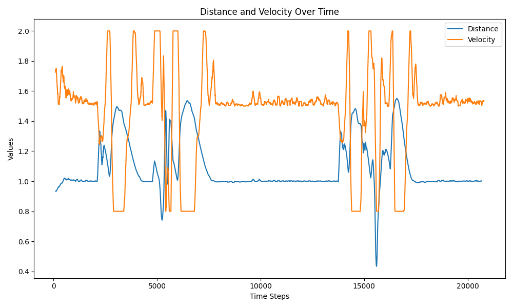
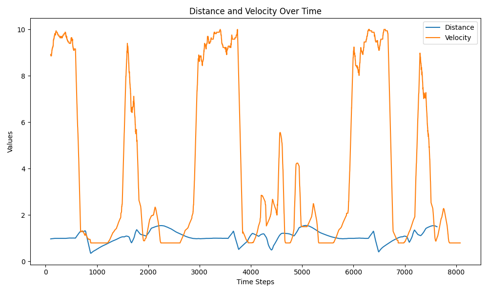

# PID实验说明文档
## 1.代码实现
### 1.1 计算小车到墙距离
1. 距离计算方法


2. 代码
    - 设置a与b之间的夹角$\theta$为50度
    - 通过以上公式计算出CD
```cpp
int index_a = (angle_a - scan_msg->angle_min) / scan_msg->angle_increment;
int index_b = (angle_b - scan_msg->angle_min) / scan_msg->angle_increment;

double dist_a = scan_msg->ranges[index_a];
double dist_b = scan_msg->ranges[index_b];

double theta = angle_b - angle_a;
double alpha = std::atan((dist_a * std::cos(theta) - dist_b) / (dist_a * std::sin(theta)));


current_dist = dist_b * std::cos(alpha) + len * std::sin(alpha);
```
### 1.2 PID算法实现
```cpp
// 在此不考虑积分增益，因为不需要考虑小车之前运行过程中的error
// dt是微分的时间间隔
derivative = (error - prev_error) / dt;
double angle = kp * error + kd * derivative;
prev_error = error;
ackermann_msgs::AckermannDriveStamped drive_msg;
drive_msg.drive.steering_angle = -angle;
```
### 1.3 转弯控制
1. 判断PID控制器得出的角度，如果角度过大，则进行相应的速度调整
```cpp
if(std::abs(angle) > 10 * (M_PI / 180.0)) {
    velocity = 0.8;
} else if(std::abs(angle) > 7 * (M_PI / 180.0)) {
    velocity = 1.3;
} else if(std::abs(angle) > 5 * (M_PI / 180.0)) {
    velocity = 1.5;
} else if(std::abs(angle) > 2 * (M_PI / 180.0)) {
    velocity = 2.0;
}
```
### 1.4参数
1. 通过不断实验，得到的最佳参数如下
```cpp
// PID CONTROL PARAMS
double kp = 0.5;
double kd = 0.1;
double ki = 0;

double dt = 0.5;
double prev_error = 0.0;
double integral = 0.0;

double target_dist = 1.0;
double angle_a = M_PI / 9 * 2;
double angle_b = M_PI / 2;
double len = 1.0;
```
## 2.算法提高
1. 说明
    - 通过在a，b之间引入**合适角度的线**（红线），通过a，b的距离计算出该线段的理论长度，并与在此角度上激光雷达的实际测量值进行比较，如果二者的误差过大，意味着a，b的端点**不在同一墙面上**，说明小车可能行驶到转弯处，则要调整速度
    - 理论长度的计算通过等面积法得出
    
```cpp
// 等面积法
double dist_cal = dist_a * dist_b * std::sin(theta) / (dist_a * std::sin(M_PI / 9) + dist_b * std::sin(M_PI / 6));
// 比较理论值与实际值
if(std::abs(dist_cal - dist_c) >= 0.028) {
    velocity = 4.0;
}
```
2. 比较
    - 这个方法可以增加判断小车转弯的准确率，如果没有这个判断，小车在高速状态下容易未及时转弯而撞墙（如图）；添加以后，可以减少该情况的发生。改进后的情况参见录屏。
    
## 3.实验结果分析与比较
1. 分别进行了小车在1.5m/s和10m/s下的实验，详见录屏
2. 结果分析
以下为1.5m/s和10m/s情况下的离墙距离和速度图像，可以看见，小车在直线行驶时，速度基本稳定，但10m/s的波动更大，同时离墙距离也基本稳定在目标距离附近；在转弯处，速度和离墙距离都发生了较大波动。


